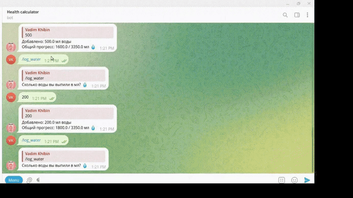

# 🏋️‍♂️ Fitness & Nutrition Tracking Bot 🤖🍏
✨ Умный телеграм-бот для отслеживания калорий, тренировок и воды с AI-рекомендациями!


## 🌟 Основные возможности
- ✅ Трекер калорий 🍎🔍 – автоматический расчет калорийности продуктов через API (с NLP-обработкой запросов)
- ✅ Трекер тренировок 🏋️‍♂️📊 – рекомендации упражнений по мышечным группам через API
- ✅ Трекер воды 💧📈 – контроль водного баланса
- ✅ PostgreSQL + SQLAlchemy 🗃️ – надежное хранение данных
- ✅ Асинхронный aiogram ⚡ – быстрая и плавная работа
- ✅ Асинхронное взаимодействие с БД ⚡ – быстро
- ✅ Docker-контейнеризация 🐳 – легкий запуск в один клик

## 🌐 Использованные API:
- [Погода](https://openweathermap.org/api) - регулирует норму воды
- [Калории]([https://openweathermap.org/api](https://api-ninjas.com/api/nutrition)) - позволяет получить калории по описанию продуктов через NLP
- [Тренировки]([https://openweathermap.org/api](https://api-ninjas.com/api/exercises)) - позволяет получить тренировку на группу мышц.

## 🔮 В планах
🧠 Собственная ML-модель для расчета калорийности по рецептам и списку продуктов

## � Структура проекта:
📂 /app – Основное приложение бота
- Bot.py 🚀 – главный файл бота (запуск, диспетчеризация)
- config.py ⚙️ – конфигурационные параметры (API-ключи, настройки БД)

📂 /app/database – Работа с PostgreSQL
- models.py 🏗️ – SQLAlchemy-модели таблиц
- crud.py 🔄 – операции с БД (CRUD)
- base.py 🏛️ – базовые настройки SQLAlchemy
- init_db.py 🛠️ – инициализация БД
- entrypoint_initdb.sh ⚡ – скрипт для первичной настройки БД в Docker

📂 /app/handlers – Обработчики команд
- base.py 🏠 – основные команды (/start, /help)
- profile.py 👤 – управление профилем и статистикой

📂 /app/middlewares – Промежуточное ПО
- middleware.py 🔄 – дополнительные обработчики запросов

📂 /app/services – Вспомогательные сервисы
- api.py 🌐 – запросы к внешним API (калории, тренировки)
- calculations.py 🧮 – расчет калорий, макросов и воды
- formatters.py ✨ – форматирование вывода
- plotters.py 📊 – генерация графиков (если есть)
- translators.py 🌍 – перевод текста (для API)
- validators.py ✅ – проверка ввода пользователя

## 🚀 Запуск проекта
1. Клонирование репозитория и переход в директорию `telegram_bot_workout`:
```
git clone https://github.com/yourusername/telegram_bot_workout.git
cd telegram_bot_workout
```

2. Создание .env и его заполнение:
```
BOT_TOKEN=<нужен токен бота для телеграма>
API_WEATHER_TOKEN=<нужен токен сервиса погоды>
API_TOKEN_FOOD=<нужен токен сервиса калорий>
API_KEY_WORKOUT=<нужен токен сервиса для тренировок>

DB_HOST=<хост базы данных>
DB_PORT=<порт базы данных>
DB_NAME=<имя базы данных>
DB_USER=<имя пользователя>
DB_PASS=<пароль базы данных>
```

3. Build всех образов и запуск docker compose 🐳:
```
docker-compose up --build
```

4. Можно пользоваться!

5. Остановка бота:
```
docker-compose down
```
